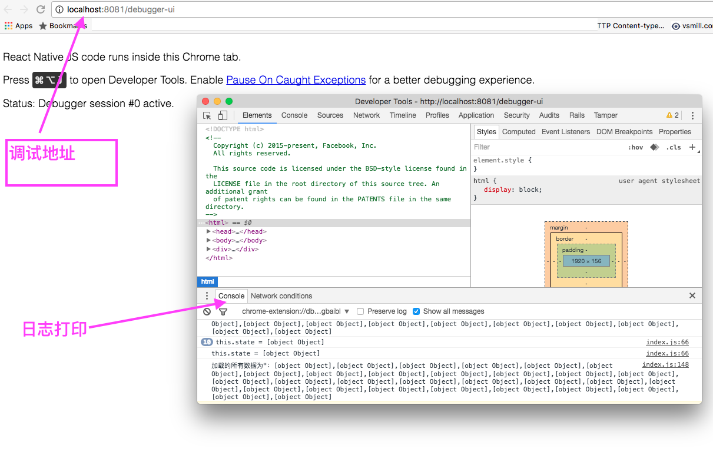

React Native是基于javascript的，所以React Native的调试基本上就是Java Script的调试。

## 通过console调试
这就是经久不衰的print调试大法, 通俗易懂，老少咸宜。

Javascript里面通过下面的语句打日志:

```
console.log("Hello world");
```

如果是打印json数据，需要把json数据转换成string再打印:

```
console.log(JSON.stringify({message:"Hello World"}));
```

日志打完以后去哪里看呢？主要有下面几种方式:

1. 如果你是通过xcode启动的iOS程序，它会打印到xcode console.
2. 如果是通过命令行启动的，你可以尝试通过remote debug, 启动chrome的调试器，然后在chrome console里面看到日志
3. 安卓应用可以通过`adb logcat`看到打印日志

截图1， chrome console 日志


## Chrome Debug UI
其实上面console.log里面已经提到了chrome debug ui.

 这个工具不太好用，因为react native的js都是打包好的文件，非常大，下断点是相当地不方便。
 
 并且，启动remote debug以后这个窗口每次启动app的时候都弹出来，是不是还会导致app启动失败，说连不上调试器。 偶尔用它看看日志，基本上放弃了。
 
## Nuclide
Nuclide 可以在js文件里面下断点。

具体步骤:
1. View -> Toggle Command Palette -> React Native:Start Packager, 这会启动一个packager server
2. View -> Toggle Command Palette -> React Native:Start Debugger. 这会启动一个远程js调试。
3. 从命令行启动iOS程序:`react-native run-ios`
4. 在iOS模拟器里面CMD+D -> Enable Remote JS debugger
5. 然后你就可以在nuclide里面给js文件下断点了

还可以用React Native Inspector查看UI结构, 具体步骤:

1. View -> Toggle Command Palette -> React Native:Start Packager, 这会启动一个packager server
2. View -> Toggle Command Palette -> React Native Insepctor: show. 这会启动一个远程UI抓取窗口。
3. 从命令行启动iOS程序:`react-native run-ios`
4. 在iOS模拟器里面CMD+D -> Show Inspector
5. 然后你就可以在nuclide里面看app的UI结构了.

截图2:


参考:
[Nuclide for React Native](https://nuclide.io/docs/platforms/react-native/)