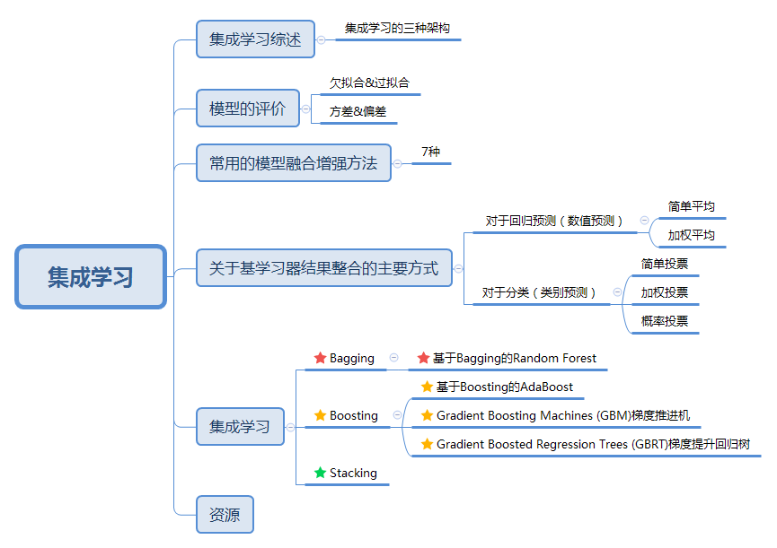
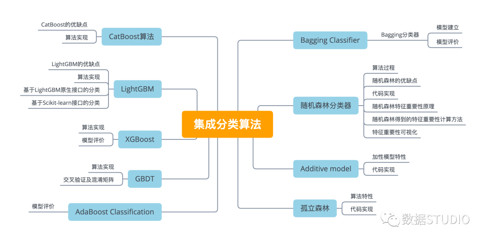

# 写在前面

就我个人而言，我在机器学习入门的时候有几大疑点对我困扰比较大。

2. 机器怎么用公式表达下面的一些非线性数学特征:
   1. 怎么表示对称关系？
   2. 怎么表示离散数据?
   3. 怎么表示封闭空间
   4. 怎么表示不连通区域集合
   5. 怎么表示跳跃
1. 机器学习怎么处理非数字信号?

先推荐大家看看[傅里叶变换交互式入门](https://www.jezzamon.com/fourier/zh-cn.html), 里面可以玩的演示工具，你画任意图形，工具都可以用傅立叶变换给你画出来. 开源的, [Jezzamonn/fourier](https://github.com/Jezzamonn/fourier), 

上面的傅立叶变换很好地解释了怎么表达非线性数学特征的问题. 当然，实际情况中会有很多傅立叶变换之外的其它函数能用来辅助解决上面的一些问题，傅立叶功能很强很全，但不是唯一解。

关于机器学习怎么处理非数字信号的问题，这就是向量化要解决的问题。所有的特征都可以想办法映射为数字信号，这就是Transformer要解决的问题。

上面两个问题想通了以后机器学习就没有什么神秘的了。

剩下的就是去理解各种算法，理解算法以后才能知道什么场景用什么算法。才能高效🉐地调参炼金。

# 初学者解惑
机器学习，深度学习, 神经网络什么关系?

注意，当我们说区别机器学习和深度学习的时候应该说传统机器学习和深度学的区别.

传统机器学习和深度学习的关系:
1. 深度学习是机器学习的一个分支, 属于机器学习非常重要的一个部分。
2. 我们常见的各种分类算法，回归算法都是传统机器学习。
3. 深度学习的概念源于人工神经网络的研究，但是并不完全等于传统神经网络。
   1. CNN, RNN, GANs, RL属于4中典型的深度学习算法.
4. 深度学习可以说是在传统神经网络基础上的升级，约等于神经网络
5. 传统机器学习和深度学习的区别是传统机器学习没有隐含层，算法不可以随意添加层数(层数影响迭代次数)
6. 机器学习的输出结果可预测性更高。因为算法都是提前设计好，固定下来了的。深度学习则更多通过神经网络去自己找规律。

7. [一文看懂深度学习](https://easyai.tech/ai-definition/deep-learning/)

# 考证和教程
机器学习要学的东西太多了，很容易迷失方向。在有一定基础的情况下，建议去考证，查漏补缺。

1. Google有考证教程.
2. Kaggle上有python, sklearn, pandas的考证.
3. LeetCode上可以无限刷题，建议就刷简单的题，用python。难的题刷起来吃天赋，性价比不高。
4.  

# 基本概念

## Softmax

# 向量化
向量化是机器学习最重要的一环。数据如果没法向量化，那就没法用机器学习去处理了。向量化的表示也会直接影响机器学习处理的结果。
## 词向量

下面对文本表示进行一个归纳，也就是对于一篇文本可以如何用数学语言表示呢？[搞懂 NLP 中的词向量，看这一篇就足够](https://www.infoq.cn/article/pfvzxggdm27453bbs24w)
1. 基于 one-hot、tf-idf、textrank 等的 bag-of-words；
1. 主题模型：LSA（SVD）、pLSA、LDA；
1. 基于词向量的固定表征：Word2vec、FastText、GloVe
1. 基于词向量的动态表征：ELMo、GPT、BERT

## 激活函数
神经网络中为了引入非线形的一种机制。

1. ReLU(The Rectified Linear Unit/修正线性单元)，它的特点是收敛快，求梯度简单，但较脆弱
2. Sigmoid
# 传统机器学习常见算法

## 逻辑回归
https://zhuanlan.zhihu.com/p/56900935

逻辑回归这个名字有误导性，它有另外一个名字，叫做对数几率回归， 这个名字更合理，因为它解释了它背后的原理，通过对数几率来做二分类。Sigmoid(x)的值在奇点从0条约到1， 实现二分类。Sigmoid(x) 其实衡量的是输入数据 x 归属于类别 1 的概率.

sigmoid函数也叫Logistic函数，用于隐层神经元输出，取值范围为(0,1)，它可以将一个实数映射到(0,1)的区间，可以用来做二分类。以0为分界点，<0时sigmoid(x)无限逼近0, x>0时sigmoid(x)无限逼近1。在特征相差比较复杂或是相差不是特别大时效果比较好。

Sigmoid作为激活函数有以下优缺点：
1. 优点：平滑、易于求导。
1. 缺点：激活函数计算量大，反向传播求误差梯度时，求导涉及除法；反向传播时，很容易就会出现梯度消失的情况，从而无法完成深层网络的训练。

知识点:
1. 也就是说，输出 Y=1 的对数几率是由输入 x 的线性函数表示的模型，这就是逻辑回归模型。
2. 核心是对数几率与输入x的线性关系. ln(P(Y=1|x)/(1 - P(Y=1|1)) = wx + b
3. 逻辑回归是在线性回归的基础上加了一个 Sigmoid 函数（非线形）映射，使得逻辑回归称为了一个优秀的分类算法。本质上来说，两者都属于广义线性模型，但他们两个要解决的问题不一样，逻辑回归解决的是分类问题，输出的是离散值，线性回归解决的是回归问题，输出的连续值。
4.

优点:
1. 直接对分类的概率建模，无需实现假设数据分布，从而避免了假设分布不准确带来的问题（区别于生成式模型）；
2. 不仅可预测出类别，还能得到该预测的概率，这对一些利用概率辅助决策的任务很有用；
   1. 因为Y是一个越迁曲线，所以大部分值落在0和1这两个点上，0和1之间的情况非常少，所以大部分情况下就是一个0和1的分类。
3. 对数几率函数是任意阶可导的凸函数，有许多数值优化算法都可以求出最优解。

others:
1. 正则化是一个通用的算法和思想，所以会产生过拟合现象的算法都可以使用正则化来避免过拟合。
    在经验风险最小化的基础上（也就是训练误差最小化），尽可能采用简单的模型，可以有效提高泛化预测精度。如果模型过于复杂，变量值稍微有点变动，就会引起预测精度问题。正则化之所以有效，就是因为其降低了特征的权重，使得模型更为简单。
1.

正则化一般会采用 L1 范式或者 L2 范式，其形式分别为 [公式] 和 [公式] 。
### 与SVM
相同点：

1. 都是分类算法，本质上都是在找最佳分类超平面；
1. 都是监督学习算法；
1. 都是判别式模型，判别模型不关心数据是怎么生成的，它只关心数据之间的差别，然后用差别来简单对给定的一个数据进行分类；
1. 都可以增加不同的正则项。

不同点：

1. LR 是一个统计的方法，SVM 是一个几何的方法；
1. SVM 的处理方法是只考虑 Support Vectors，也就是和分类最相关的少数点去学习分类器。而逻辑回归通过非线性映射减小了离分类平面较远的点的权重，相对提升了与分类最相关的数据点的权重；
1. 损失函数不同：LR 的损失函数是交叉熵，SVM 的损失函数是 HingeLoss，这两个损失函数的目的都是增加对分类影响较大的数据点的权重，减少与分类关系较小的数据点的权重。对 HingeLoss 来说，其零区域对应的正是非支持向量的普通样本，从而所有的普通样本都不参与最终超平面的决定，这是支持向量机最大的优势所在，对训练样本数目的依赖大减少，而且提高了训练效率；
1. LR 是参数模型，SVM 是非参数模型，参数模型的前提是假设数据服从某一分布，该分布由一些参数确定（比如正太分布由均值和方差确定），在此基础上构建的模型称为参数模型；非参数模型对于总体的分布不做任何假设，只是知道总体是一个随机变量，其分布是存在的（分布中也可能存在参数），但是无法知道其分布的形式，更不知道分布的相关参数，只有在给定一些样本的条件下，能够依据非参数统计的方法进行推断。所以 LR 受数据分布影响，尤其是样本不均衡时影响很大，需要先做平衡，而 SVM 不直接依赖于分布；
1. LR 可以产生概率，SVM 不能；
1. LR 不依赖样本之间的距离，SVM 是基于距离的；
1. LR 相对来说模型更简单好理解，特别是大规模线性分类时并行计算比较方便。而 SVM 的理解和优化相对来说复杂一些，SVM 转化为对偶问题后，分类只需要计算与少数几个支持向量的距离，这个在进行复杂核函数计算时优势很明显，能够大大简化模型和计算。

## SVM
1. 通过核函数，把二维数据变成3维数据，然后在3维空间进行平面分割。是一个分类算法。
2.

## K-Means

算法执行过程如下:
1. 随便选择K个中心点（大哥）。
1. 把距离它足够近的数据（小弟）吸纳为成员，聚成K个集群（组织）。
1. 各集群（组织）内部重新选择中心点（大哥），选择标准是按照距离取均值作为中心点（大哥）。
1. 重复2、3步骤直到收敛（组织成员相对稳定）。

## 决策树

1. 决策树是一个多层if-else函数，对对象属性进行多层if-else判断，从而获取目标属性的类别。
1. 由于只是用if-else对特征属性进行判断，所以一般特征属性为离散值；
1. 即使为连续值也会先进行区间离散化，如可以采用二分法。

## KNN算法概述
1. KNN是最简单的分类算法之一，也是最常见的分类算法之一
1. KNN算法是有监督学习中的分类算法
1. KNN算法和无监督学习算法K-means有些相像，但是却有本质区别
1. 使用数据范围：数值型和标称型
1. 通常K是不大于20的整数
2. 训练快，训练的过程就是寻找最优K的过程. 原数据需要保留在model里用于分类。
3. KNN特点
   ~~~
      KNN是一种非参的，惰性的算法模型。什么是非参，什么是惰性呢？

      非参的意思并不是说这个算法不需要参数，而是意味着这个模型不会对数据做出任何的假设，与之相对的是线性回归（我们总会假设线性回归是一条直线）。也就是说KNN建立的模型结构是根据数据来决定的，这也比较符合现实的情况，毕竟在现实中的情况往往与理论上的假设是不相符的。

      惰性又是什么意思呢？想想看，同样是分类算法，逻辑回归需要先对数据进行大量训练（tranning），最后才会得到一个算法模型。而KNN算法却不需要，它没有明确的训练数据的过程，或者说这个过程很快。

      ** KNN算法的优势和劣势 **

         了解KNN算法的优势和劣势，可以帮助我们在选择学习算法的时候做出更加明智的决定。那我们就来看看KNN算法都有哪些优势以及其缺陷所在！

      ** KNN算法优点 **
         简单易用，相比其他算法，KNN算是比较简洁明了的算法。即使没有很高的数学基础也能搞清楚它的原理。
         模型训练时间快，上面说到KNN算法是惰性的，这里也就不再过多讲述。
         预测效果好。
         对异常值不敏感

      ** KNN算法缺点 ** 
         对内存要求较高，因为该算法存储了所有训练数据
         预测阶段可能很慢
         对不相关的功能和数据规模敏感
   ~~~
1.  集成学习
    1.  集成学习会挑选一些简单的基础模型进行组装，组装这些基础模型的思路主要有 2 种方法：
          1. bagging（bootstrap aggregating的缩写，也称作“套袋法”）
          2. boosting
          3. [图文读懂集成学习](https://github.com/THUDataPI/TechnologyOverview/blob/master/%E4%B8%80%E6%96%87%E8%AF%BB%E6%87%82%E9%9B%86%E6%88%90%E5%AD%A6%E4%B9%A0/%E4%B8%80%E6%96%87%E8%AF%BB%E6%87%82%E9%9B%86%E6%88%90%E5%AD%A6%E4%B9%A0.md)
            1.  
    2.  [一文看懂集成学习](https://easyaitech.medium.com/%E4%B8%80%E6%96%87%E7%9C%8B%E6%87%82%E9%9B%86%E6%88%90%E5%AD%A6%E4%B9%A0-%E8%AF%A6%E8%A7%A3-bagging-boosting-%E4%BB%A5%E5%8F%8A%E4%BB%96%E4%BB%AC%E7%9A%84-4-%E7%82%B9%E5%8C%BA%E5%88%AB-6e3c72df05b8)
        1.  在 bagging 的方法中，最广为熟知的就是随机森林了：bagging + 决策树 = 随机森林
    3.  [机器学习--集成学习（Ensemble Learning）](https://www.cnblogs.com/zongfa/p/9304353.html), 集成方法是将几种机器学习技术组合成一个预测模型的元算法，以达到减小方差（bagging）、偏差（boosting）或改进预测（stacking）的效果。
        1.  集合方法可分为两类：
            1.  序列集成方法，其中参与训练的基础学习器按照顺序生成（例如 AdaBoost）。序列方法的原理是利用基础学习器之间的依赖关系。通过对之前训练中错误标记的样本赋值较高的权重，可以提高整体的预测效果。
            2.  并行集成方法，其中参与训练的基础学习器并行生成（例如 Random Forest）。并行方法的原理是利用基础学习器之间的独立性，通过平均可以显著降低错误。
    4.  [集成学习算法(Ensemble Method)浅析](https://www.jiqizhixin.com/articles/2018-12-28-11)
    5.  [总结了九种机器学习集成分类算法(原理+代码)](https://cloud.tencent.com/developer/article/1861382)
        1.  
    6.  [机器学习集成学习 Ensemble Learning（常用集成算法汇总）](https://blog.csdn.net/weixin_39948381/article/details/106442535)

# 深度学习常见算法

## CNN

1. 池化层, 池化层夹在连续的卷积层中间， 用于压缩数据和参数的量，减小过拟合。 简而言之，如果输入是图像的话，那么池化层的最主要作用就是压缩图像。
2. 池化层用的方法有 Max pooling 和 average pooling，分别是取最大值和取平均值, 而实际用的较多的是Max pooling。
## RNN循环神经网络

### seq2seq模型(RNN变种)
## Transformer
Transformer是一个利用注意力机制来提高模型训练速度的模型。

注意力（Attention）机制由Bengio团队与2014年提出并在近年广泛的应用在深度学习中的各个领域，例如在计算机视觉方向用于捕捉图像上的感受野，或者NLP中用于定位关键token或者特征。谷歌团队提出的用于生成词向量的BERT算法在NLP的11项任务中取得了效果的大幅提升，堪称2018年深度学习领域最振奋人心的消息。而BERT算法的最重要的部分便是Transformer的概念。

主要包含:
1. Encoders
   1. 结构是一个自注意力机制(Self-Attention)加上一个前馈神经网络(Feed Forward Neural Network)。
   2. self-attention的输入就是词向量，即整个模型的最初的输入是词向量的形式。
   3.
2. Decoders
3. Transformer由且仅由self-Attenion和Feed Forward Neural Network组成。

# 工具
1. [Model Zoo](https://modelzoo.co/)中有大量预训练好的模型供使用
1. [ONNX Model Zoo](https://onnx.ai/models/)有很多精选的模型, [Github](https://github.com/onnx/models)
2. [TensorFlow Hub](https://www.tensorflow.org/hub?hl=zh-cn) 是一个包含经过训练的机器学习模型的代码库。
3. [Kaggle](https://www.kaggle.com/), Kaggle是一个面向数据科学家和机器学习爱好者的社区平台，提供了大量的数据集、AI模型和竞赛。用户可以在这里找到各种领域的AI模型，如金融、医疗、电商等。同时，Kaggle还定期举办各种机器学习竞赛，吸引了全球最优秀的AI人才参与，为用户提供了丰富的学习和交流机会。

参考:
   1. [十分钟理解Transformer](https://zhuanlan.zhihu.com/p/82312421)
   2. [详解Transformer(Attention Is All You Need)](https://zhuanlan.zhihu.com/p/48508221)
   3. 
# refs
1. [AI知识库, easyai.tech](https://easyai.tech/ai-definition/decision-tree/)
2. [【非常详细】通俗易懂的讲解决策树（Decision Tree）](https://zhuanlan.zhihu.com/p/197476119)
3. [机器学习-决策树算法](https://www.kancloud.cn/buildupchao/machine-learning/2146031)
4. [决策树ID3算法的思路](https://www.cnblogs.com/pinard/p/6050306.html)
5. [机器学习笔记(3)-sklearn支持向量机SVM](https://www.jianshu.com/p/a9f9954355b3)
6. [支持向量机通俗导论（理解SVM的三层境界](https://blog.csdn.net/v_july_v/article/details/7624837)
7. [卷积神经网络](https://charmve.github.io/computer-vision-in-action/#/1_%E7%90%86%E8%AE%BA%E7%AF%87/chapter2_CNN/chapter2_CNN)
8.  强烈推荐读这篇文章，[使用 OpenCV 将卷积实现为图像过滤器](https://mp.weixin.qq.com/s/MRPIAWqr8LtXbnGrxpDCrA), 这篇文章把卷积和图像过滤器整合成一个概念，让我豁然开朗，一下子明白了CNN的意义, 简单理解CNN就是一个过滤器，过滤器就是特征提取器，过滤后的内容就是提取后的特征。
9.  傅立叶变换
    1.  [傅里叶变换交互式入门](https://www.jezzamon.com/fourier/zh-cn.html)
    2.  [Jezzamonn/fourier](https://github.com/Jezzamonn/fourier)
10. [图文读懂集成学习](https://github.com/THUDataPI/TechnologyOverview/blob/master/%E4%B8%80%E6%96%87%E8%AF%BB%E6%87%82%E9%9B%86%E6%88%90%E5%AD%A6%E4%B9%A0/%E4%B8%80%E6%96%87%E8%AF%BB%E6%87%82%E9%9B%86%E6%88%90%E5%AD%A6%E4%B9%A0.md)
    1.  
11. 