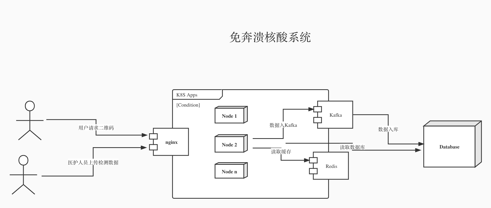

# 背景
上海在4月初的时候换了核酸系统，切换到了某软用的核酸码系统。然后不出所料，上线之日就是系统崩溃之时。核酸码系统崩了。 然后为了避开高峰不让核酸码系统崩溃，还有凌晨安排搞核酸的。

匆忙上系统，难免会遇到需求不清晰，应用场景理解不透，测试不充分导致的业务逻辑方面的问题，性能的问题，安全的问题等。

当然，如果遇到经验不足的程序员，写出从服务器端拉二维码图片的代码，那怎么对服务器都没有办法了。

注: 本文本着研究的目的尝试分析问题和寻找解决方案，所有的分析、方案和代码都没有经过实际检验，不具备实际生产的价值。

# 需求分析
我们先对核酸码系统做一些简单的需求分析，列出一些关键指标. 为了防止核酸码系统再次崩溃，我们会在分析的时候尽量把要求提高一点，防止突发情况把系统搞崩溃。

简单列出需求如下:
1. 2500万人，每人每天一次
2. 核酸从早上9点开始，到下午3点结束。按平均算的话最低rps为 25000000/(6*60*60) = 1157
3. 不强制要求核酸点错开做核酸。并发量计算如下:
   1. 假设每个小区为5千人, 那么整个上海5000个小区, 
   3. 5组医护人员同时测。平均5秒测试完一个人。
   2. 所有小区在同一时间点开搞，这有一个前提，上海得有那么多医护人员。
   4. 那么意味着每秒请求量为5* 5 * 5000 = 125000
4. 按上一步的估算，假设取125000rps为压力上线。
5. 完成一套流程至少需要一下四个API:
   1. 用户登陆
   2. 二维码生成
   3. 核验二维码.
   4. 上传检测分组数据.
6. 核酸检测中用户登陆，用户二维码生成、医生核验二维码和上传分组数据这四个基本步骤为一组，成为基本套件。
   1. 所以总rps得放大3倍，到375000rps
   2. 后面会分步分析每个API需要的资源以及对应的方案。实际的rps会按具体场景和技术方案做进一步矫正。
7. 假设本系统不连公安系统，不存在从内网拉数据的需求，不会存在特别耗时的数据同步场景.
8. 要防止邪恶势力攻击.
   
目前为止，我们能得到核心的需求，在正确满足业务需求的情况下，我们要能达到最大375000rps的吞吐量。

# 性能分析

本系统最核心的性能问题为响应速度的问题。本文假设磁盘，内存都是可以无限的扩展的。

对于恶意攻击，这个话题太大，不在本文覆盖范围.

系统的性能瓶颈主要在以下几个方面:
1. 数据库读写操作。这是最容易遇到瓶颈的地方。
2. 网络传输。
3. 服务器端并发读请求。

现在对三个核心api一一分析系统的性能问题。

登陆API:
1. 登陆的身份认证是走微信和支付宝的. 假设系统拿到小程序的认证信息以后不需要去支付宝或者微信做二次验证，可以直接用secret key完成验证.这样就不存在大量请求在服务器端阻塞的情况。
2. 登陆的用户都可以通过身份证号来识别,这给直接在内存数据库登陆提供了可能。 在支付宝完成身份认证，把身份证id传回来后就可以直接把登陆状态写入redis这类内存数据库，完成系统登陆。
3. 从上面的分析来看，登陆API相对简单，通过redis缓存数据可以消除大量读写数据库的情况，也不存在大量请求同时出去的情况. 
   1. 假设一台redis可以完成10w请求每秒，那么125000并发用户只需要2台左右redis服务器.
   2. 前端服务器可以按5k/台配置, 配25台服务器. 这个也看具体的技术框架和计算量。如果是rails这种框架，堆服务器也没用了。而像nodejs,基于事件的异步系统，非常适合这种场景。go也很适合。java得看具体实现者的水平, 锁操作不好会造成很大资源浪费, 严重降低性能. 我以前做过一个各种框架并发性能对比的项目, 有总结过一些数据, 对比数据和代码可以看这里[NodeBenchmark](https://github.com/younthu/WebFrameworkBenchmark), 欢迎提pr讨论.
   3. nginx一台可以满足需求. 假设每个请求能在100ms内完成, 那么nginx只要撑住1.25w并发就可以了, 不会触摸到65k tcp端口的上限, 系统层面一个tcp链接需要占用一个端口，最高只能有65536个端口可用，还得扣除系统保留的一些端口.
   

用户二维码API:
1. 从健康码解出来的字符串如下，这是一个离线码: https://qrcode.sh.gov.cn/enterprise/scene?f=2&m=QzVEMTk2MTMwRUIyNzdDMDhFNjA5Q0Y3MTcwQkFEMkIyMjc2Rjk0QzBFQkM2RkI5OERDMkE5Nzc2xxxxxxxxxx==687d6af4459ca2f9d908ca75f4b0081649746xxxxxxxxxxxxxxxx
2. 从上面的二维码推测，
   1. f代表码类型
   2. m代表消息载体
   3. m被'=='分割成两部分，前面一半应该是身份证信息和生成时间, '=='后面是类似key的东西,解码前半部分用的.
   4. 因为是离线码，可以猜测, 医护人员验身份的时候是离线扫二维码然后抽取信息直接登记在本地。满一管的时候再上传。所以医护人员验码的时候如果是十人一管，那么请求数量可以变为十分之一.
3. 从上面的分析可以看出，这个API可以在内存数据库完成，甚至可以在登陆的时候就把数据准备好，小程序里面根据登陆的数据直接生成二维码。
4. 按上面的假设，这个API请求量只有登陆api的十分之一，所以对服务器要求更小. 服务器数量可以在登陆API预估服务器数量基础上加10%左右. web服务器加3台，总数达到28台。redis不需要加.

核酸码核验API:

1. 根据前面的分析，核验逻辑可以写死在小程序里面，只需要医护人员启动小程序的时候把参数初始化好就可以了，这些不会成为性能瓶颈，跳过分析，也不用加机器.

上传分组数据:
1. 这个API根据10人一管的原则，rps可以降低为前面的十分之一，也就是12500. 
2. 但是这个API会有大量的数据写入，会产生瓶颈，这是需要重点设计的地方。
3. 因为这个数据写入不需要实时写入，可以通过message queue延时写入，所以数据写入压力大大降低。
4. 本文会以Kafka为Message Queue,所有的分组数据写入Kafka，再延时写入数据库。后面数据库用sql还是nosql关系不是非常大了(有的数据库数据量上千万以后写入会变慢，值得仔细分析)。
5. Kafka可以轻松上百万qps, 所以配一台Kafka是够的。
6. 在数据库写入方面，可以通过身份证日期做分裤分表, 达到提高写入数据的目的。也可以考虑用es, 或者mongodb做nosql，直接提高数据库写入速度。

到目前为止我们大致得出一个初步预估，需要大概30台服务器，能扛住极端情况。

# 技术选型及规划

   1. nginx做web容器，每个nginx后面挂若干web服务器
   6. 先实现单体应用，然后扩展成分布式架构,通过K8S做集群部署。方便自动扩容，自动伸缩.
   2. web用golang、nodejs或者java, 能满足高并发的需求。
   3. Redis做缓存，用户登陆信息尽量入redis
   4. 在鼻拭子分组采集数据入库方面用Kafka做延时写入，削峰填谷。
   5. 管理后台用脚本语言实现.
   7. mysql/psql分库分表，或者用es, mongo db等nosql数据库, 提高数据库写入速度.

系统架构图如下:

本文到此为止需求分析和技术选型架构设计完毕。

接下来会做代码实现.

# 参考
1. [百万级QPS，支撑淘宝双11需要哪些技术](https://zhuanlan.zhihu.com/p/425247346)
2. [QPS,TPS,RPS你知道多少?](https://blog.csdn.net/weixin_41709748/article/details/104625459)
3. [Kafka 性能篇：为何 Kafka 这么快？](https://segmentfault.com/a/1190000039702782)

欢迎加微信群讨论，扫下面的二维码拉入群, 请备注'核酸码':
