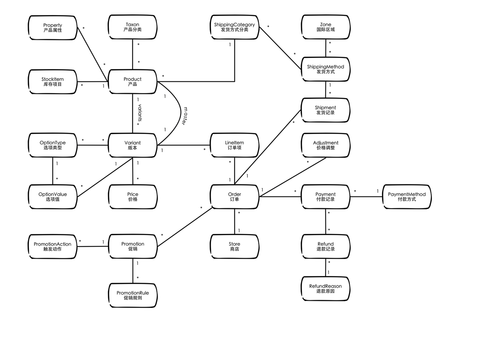
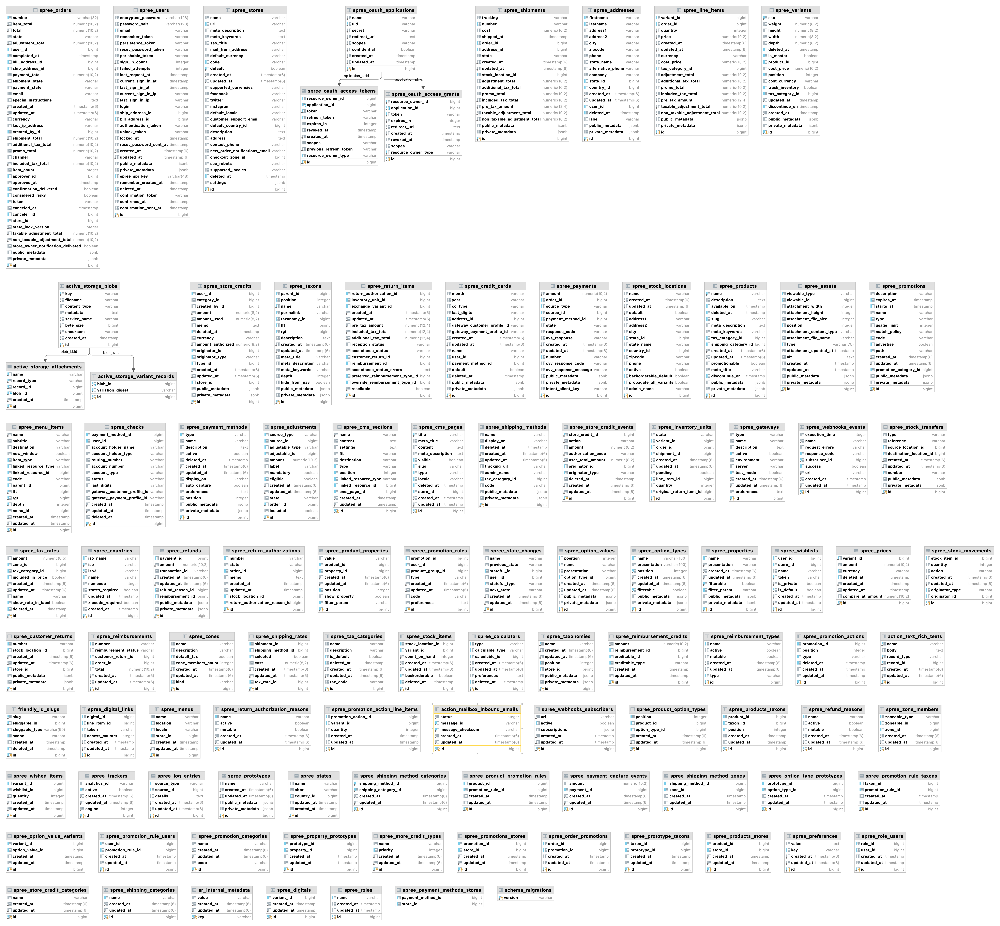

# Demo

# 搭建spree系统

# Spree模型分析

## Product 模型

Ruby China上面有一篇[Spree 源码导读](https://ruby-china.org/topics/24472)
1. Product, 商品.
   1. 所有的内容都围绕Product展开
   2. 官方有对prodct的[详细解释](https://dev-docs.spreecommerce.org/internals/products).
2. Variants, 商品的版本
   1. has many variants
   2. has one master variant
   3. 采用 Variant 来实现同一产品的不同套餐型号（每个型号的名称来自于全局设定的 OptionType，值采用 OptionValue 存储），关联多个价格是因为它支持针对不同地域定制不同的价格。
   4. 订单是绑定到Variant上的, Order->LineItem->Variant
3. Order, 订单
4. 

# ref
1. [Spree Starter](https://github.com/spree/spree_starter)
1. [Solidus, Spree fork](https://github.com/solidusio/solidus), spree的一个fork, spree团队弃坑的时候fork出去的。现在spree被另外一个商业公司接管了。
1. [Spree github](https://github.com/spree)
2. [Spree插件开发 - ruby china](https://ruby-china.org/topics/39765)
3. [Spree Store front API SDK - official](https://github.com/spree/spree-storefront-api-v2-js-sdk), 客户端都不用自己开发SDK了。
4. [Spree Auth (Devise)](https://github.com/spree)
5. [Next.js Commerce](https://github.com/spree/nextjs-commerce), Next.js Commerce integrates out-of-the-box with BigCommerce, Shopify, Swell, Saleor, Vendure, Spree and Commerce.js. We plan to support all major ecommerce backends. 很疯狂的一个东西.
6. [Spree 电商系统开发概要](https://yafeilee.com/blogs/84), 李亚飞的博客, 介绍了spree的一些基础知识.
7. [ 干货分享：通过 Spree 开源代码学 Ruby 和 Rails](https://ruby-china.org/topics/31191), 介绍了spree decorator的实现机制。
8. [Spree 源码导读](https://ruby-china.org/topics/24472)
9. [Getting Started with Spree](http://railscasts.com/episodes/298-getting-started-with-spree?view=asciicast), rails cast, 2011年的视频教程，很老了.
