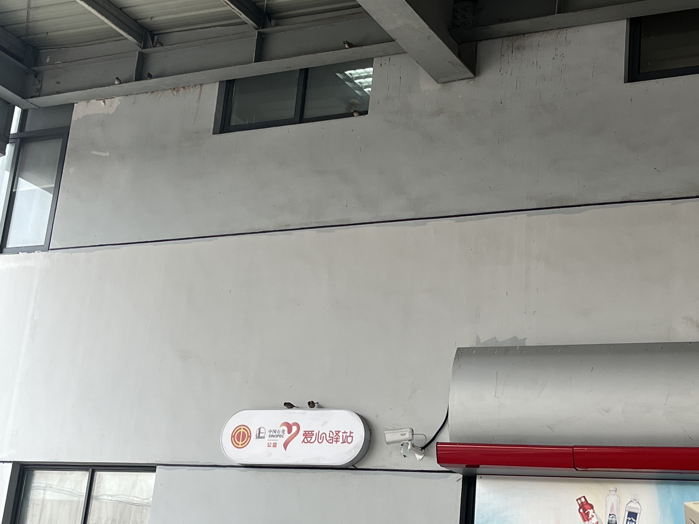
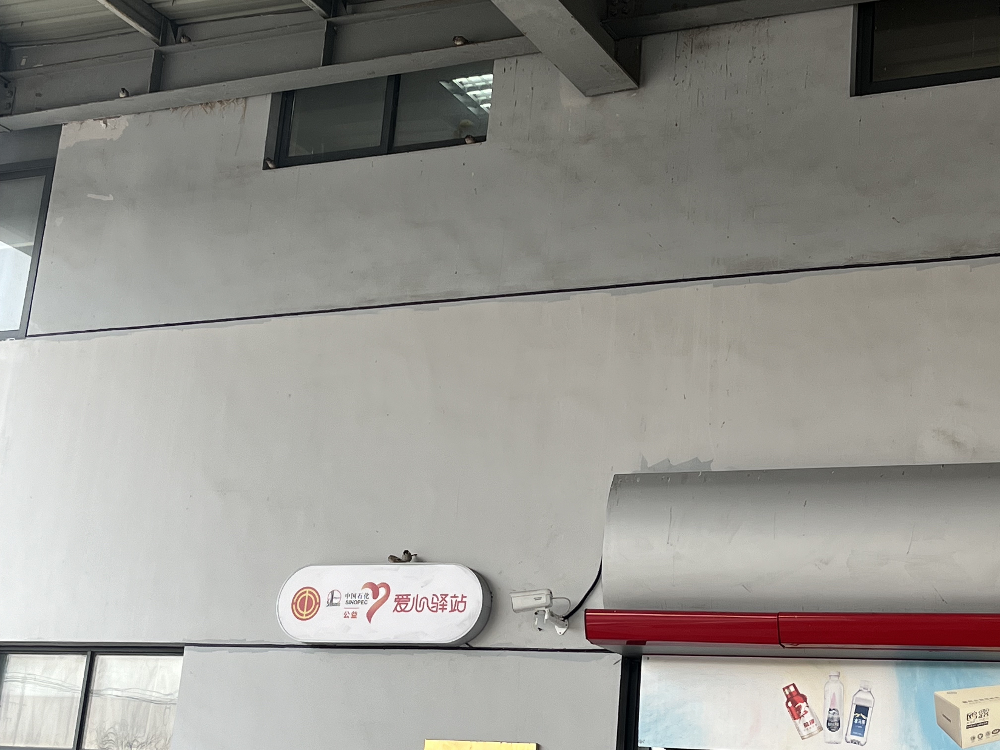

早晨，加油站，阳光明媚！
麻雀在屋顶横梁和窗户之间飞来飞去，叽叽喳喳！

瞬间让我想起了小时候，田野中间的打米机房。

那是一个平顶水泥砖房，四四方方，杵在远处，田野里。像碉堡，又像哨岗，只是它的窗户是一个方洞，没有玻璃，甚至连窗户框都没有。门也不用说， 有门洞，没有门。

它是一个抽水机房，房子外面有抽水设备，负责抽水灌溉农田。

同时它也是一个打米机房。一个大功率电动机，皮带连接外面的抽水机的时候，它就负责抽水。皮带连接室内的打米机的时候，它就负责打米。 这在当时的农村是标配，一机两用，连的是三相电，中学物理会讲到这些。

打米的时候总是会有一些稻谷碎米散落在机房里，于是，那里成了麻雀的家，有稻米的地方就有麻雀。

爸爸是机房主管兼总工程师兼操作员，于是，在我读书之前，我在那里有很长一段的“实习”经历。 大人抽水的时候我跟过去玩水，大人打米的时候我跟过去看热闹，打米的时候房间里灰尘漫天，像演西游记一样。

平时我也爱去。因为打完米，没人的时候，房间里会住满麻雀。麻雀叽叽喳喳的声音把房间填得满满的，房间的门和窗是开放式的，关不住声音，老远就能听到里面一屋子的麻雀声。

小孩子最喜欢这种声音了！ 总喜欢贴墙壁外面，偷偷往里看，想猛地冲进去，抓几只麻雀。 如果能抓一只麻雀当宠物，那还不立马成为全村最靓的仔？

我从来没有抓到过麻雀，也从来没有放弃过抓麻雀。

抓不到麻雀的日子里，听听满屋子的麻雀声，就已经很开心了！ 因为它们都是我奋斗的目标。

