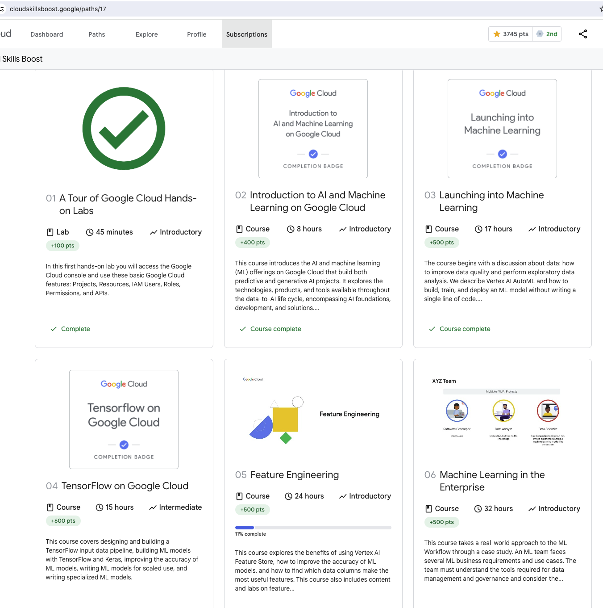
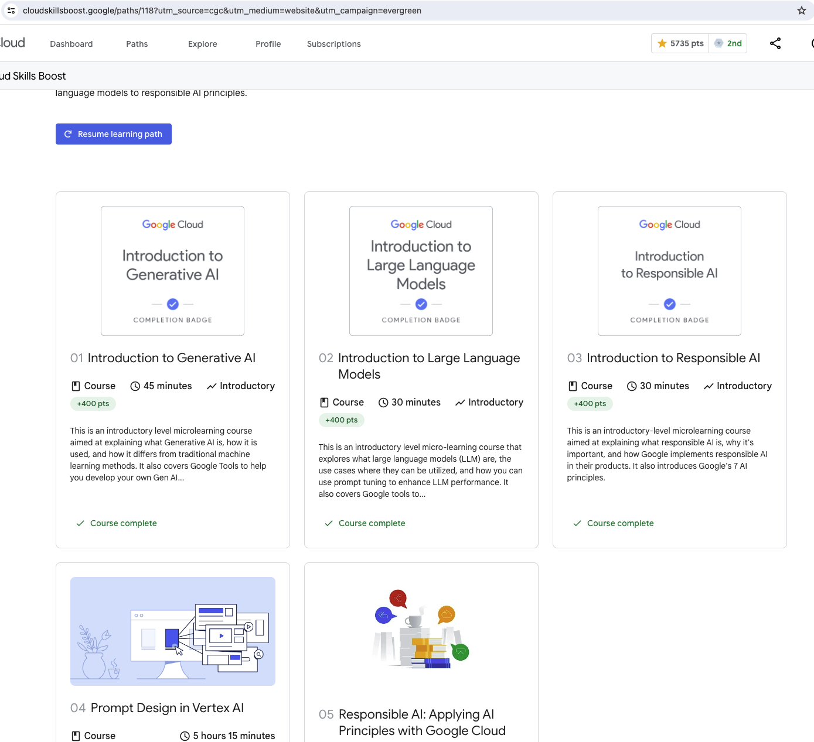

# 杂记
1. 可以通过1个月的试用订阅完成学习和考试。
2. 网址: https://cloud.google.com/learn/training/machinelearning-ai
3. qwiklabs打开的时候可能会提示输入手机号，然后提示不让登录。解决办法是用Cloud PC, 从新加坡登录. 复制"Open Google Console"的链接，在Cloud PC的Chrome浏览器里面打开.
1. Vertex AI, AutoML,
2. All of these models stem from the most basic: artificial neural network (or ANN).
3. Here you must use softmax, which is the activation function for multi-class classification.
4. Sigmoid is for binary classification
Solutions Comparison Screenshot.

# 进度

截止到7/16, 
1. 学完了[Machine Learning Engineer Learning Path](https://www.cloudskillsboost.google/paths/17)的4个课程。拿到了3个badge，第一个没有badge. 
   1. 
   2. 这4个课程差不多花了我整一个周末. 题目都比较简单，知识点都是以前学过的，所以学起来很轻松。基本上前面的一些测试都是满分通过。
   3. google会提供账号做实验。我本地登录实验账号的时候会有安全检测，要绑定手机号，通不过检测。我就在Cloud PC上做实验，新加坡的机器，google就不要求绑定手机号了。轻松做实验。
   4. 做实验的时候每个notebook都会有对应的solution notebook.
   5. 实验代码(notebooks)在`git clone https://github.com/GoogleCloudPlatform/training-data-analyst`
   6. 有几个tensorflow的教程，用到了[tensorflow playground](https://playground.tensorflow.org/)
      1. `https://goo.gl/VyoRWX` , Try solving this with a neural network
         1. `https://www.cloudskillsboost.google/paths/17/course_templates/8/video/487232` 教程    
      2. `https://goo.gl/hrXd9T`, train spiral data with neural network
         1. `https://www.cloudskillsboost.google/paths/17/course_templates/8/video/487232`
      3. `https://goo.gl/EEuEGp` , Train your first model,
         1. `https://www.cloudskillsboost.google/paths/17/course_templates/8/video/487230`
      4. `https://goo.gl/ou9iMB` , split circles
         1. `https://www.cloudskillsboost.google/paths/17/course_templates/8/video/487231`
      5. 
   7. Feature Engineering开了一个头，没有继续下去，这1⃣️实战性为主，在生产中去锻炼吧。
   8. google course每课学完以后都有
2. 学完了[Machine Learning AI](https://cloud.google.com/learn/training/machinelearning-ai)
   1. 第一节，半个小时，满分通过。
   2. 第2节满分通过.
   3. 第3节75%通过。
   4. [第4节](https://www.cloudskillsboost.google/paths/118/course_templates/976/labs/489805)非常简单，`/lab/tree/generative-ai/language/prompts/examples/chain_of_thought_react.ipynb`目录下有CoT的例子。
   5. 拿了3个badge，后面的还剩两个没有走完。

总体来说，这些课程都是以入门为主，原理讲解比较浅，然后和google cloud service绑定比较深。就入门和拿证书来说，这是不错的选择。毕竟可以免费嫖一个月。如果时间充足的话，一个月可以刷很多课程。